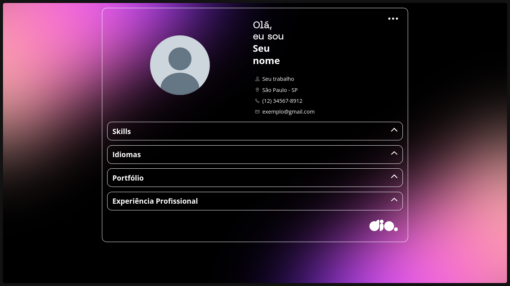

# Simple Portfolio

<div align="center">

</div>

<p align="center">
  
  
  
  
  
  
</p>

---

## 📝 Sobre o Projeto

O **Simple Portfolio** é um projeto de portfólio pessoal desenvolvido para destacar habilidades, experiências profissionais e projetos realizados de forma atrativa e eficiente. 
A principal motivação é fornecer uma solução simples, responsiva e leve para quem busca apresentar seu perfil digital, sendo facilmente customizável e adaptável a diferentes necessidades.

## ✨ Funcionalidades

- Interface responsiva compatível com dispositivos móveis e desktops.
- Seção para apresentação pessoal (sobre mim).
- Exibição de projetos com descrição, links e imagens.
- Área para informações de contato (email, redes sociais).
- Visual moderno com animações suaves em CSS.
- Estrutura modular facilitando customizações por quem mantém o projeto.

## 🛠 Tecnologias Utilizadas

- **Frontend**:
  - [HTML5](https://developer.mozilla.org/pt-BR/docs/Web/HTML)
  - [CSS3](https://developer.mozilla.org/pt-BR/docs/Web/CSS)
  - [JavaScript](https://developer.mozilla.org/pt-BR/docs/Web/JavaScript)
- **Assets**:
  - Imagens, SVGs e outros recursos estáticos em `/assets`

## 🚀 Pré-requisitos e Instalação

Certifique-se de ter um navegador moderno (ex: Chrome, Firefox, Edge) instalado. Para rodar localmente:

```bash
# Clone o repositório
git clone https://github.com/GeovanniJDA/simple-portfolio.git

# Acesse a pasta do projeto
cd simple-portfolio

# Abra o index.html em seu navegador ou utilize um Live Server
# Exemplo com Python (opcional):
python -m http.server
# Depois, acesse http://localhost:8000 no navegador
```

## 💡 Como Usar

Após instalar, basta abrir o arquivo `index.html` em seu navegador favorito.

Se desejar publicar seu portfólio:
1. Personalize os dados em `index.html`.
2. Hospede os arquivos em um serviço de páginas estáticas, como GitHub Pages, Vercel ou Netlify.

## 📂 Estrutura de Pastas

```plaintext
.
├── .vscode           # Configurações de ambiente (opcional)
├── assets/           # Imagens, ícones e recursos estáticos
├── data/             # Dados estruturados, como perfil e projetos
├── index.html        # Página principal do portfólio
```

## 🤝 Contribuição

Contribuições são muito bem-vindas! Sinta-se à vontade para abrir issues, enviar pull requests ou sugerir melhorias.

## 📜 Licença

Este projeto está sob a licença MIT. Leia o arquivo LICENSE para mais informações.

---

*Criado e mantido por GeovanniJDA.*
